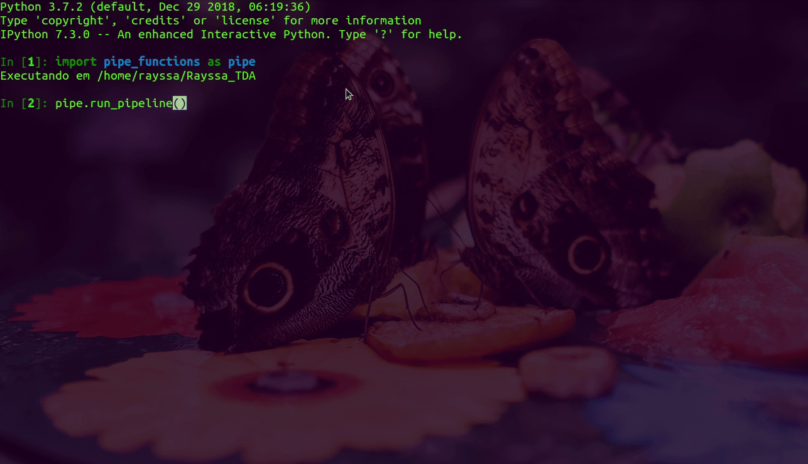
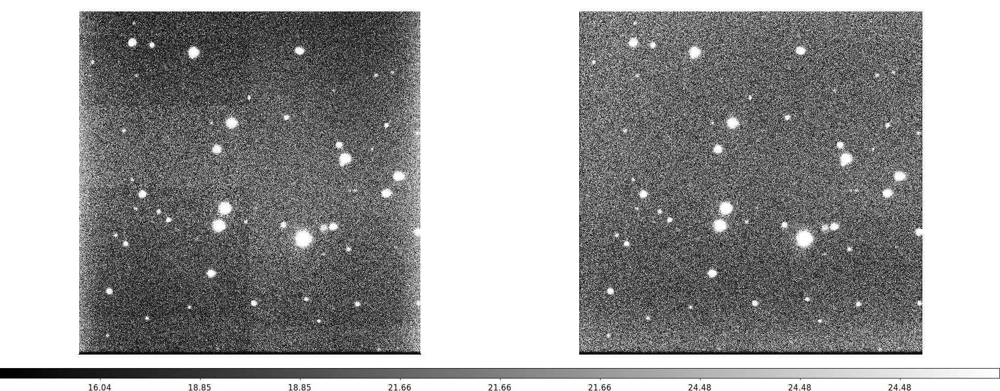

# Ceci est une pipe(line)

Esse projeto visa a criação de um pipeline básico para redução de dados astronômicos em Python. Faz parte da avaliação da disciplina Tratamento de Dados Astronômicos do curso de Astronomia do Observatório do Valongo/Universidade Federal do Rio de Janeiro.

## Execução
Para utilizar as funções basta abrir um terminal e importar o módulo `pipe_functions` e executar a função `run_pipeline`.

```python
import sys
sys.path.insert(0, '/caminho/para/diretorio/pipe_functions')
```

O resto do código é interativo e auto explicativo. No caso de dúvidas a documentação pode ser encontrada em `help(pipe_functions)`.



## Exemplo
A imagem da direita é a da esquerda após ser corrigida pelo pipeline. 